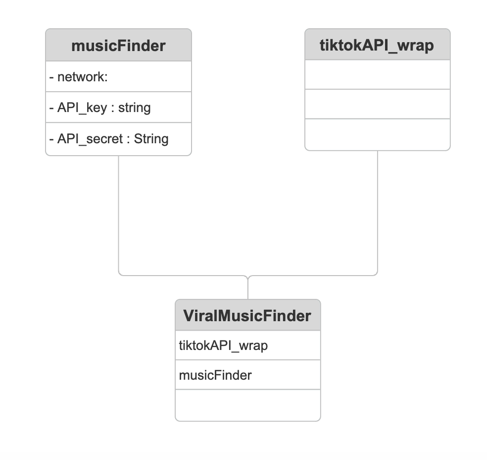

# ViralMusicExplorer

**ViralMusicExplorer** is an innovative tool that helps users discover similar songs based on their preferences developed for the company parasition. By simply inputting a song title, the program not only suggests similar tracks but also analyzes their potential virality on a social media platform of choice.

## How It Works

1. **Input a Song**: The user enters a song they enjoy or want to explore further.
2. **Find Similar Tracks**: The program identifies songs with similar characteristics.
3. **Social Media Virality**: The tool checks which of these similar tracks are gaining traction on the selected social media platform, providing insights into trending songs.

## Why Use Music Finder?

- **Discover New Music**: Explore tracks that align with your music taste and discover new favorites.
- **Get Inspiration for Viral Content**: If a song has gone viral, the outputted similar songs are likely to follow similar trends, giving you ideas for creating viral content around them.

Music Finder combines music discovery with social media trends to keep you ahead of the curve. Whether you’re a content creator or just love discovering new music, this tool helps you stay connected to the latest viral trends!

## Technical Documentation



## LastfmAPI class to retreive track information

```python
    lastfm = LastfmAPI(API_KEY, API_SECRET)

    # (1) Get similar tracks
    similar_tracks = lastfm.get_similar_tracks("Billie Jean", "Michael Jackson")
    print("Similar Tracks:", similar_tracks)

    # (2) Get top tracks of an artist
    top_tracks = lastfm.get_top_tracks("The Weeknd")
    print("Top Tracks:", top_tracks)

    # (3) Get album info
    album_info = lastfm.get_album_info("The Weeknd", "After Hours")
    print("Album Info:", album_info)

    # (4) Get global trending tracks
    trending_tracks = lastfm.get_global_trending_tracks()
    print("Trending Tracks:", trending_tracks)

    # (5) Get track tags (genres)
    track_tags = lastfm.get_track_tags("Blinding Lights", "The Weeknd")
    print("Track Tags:", track_tags)
```
__output for the code above:__

__`(1):`__ 
```plaintext
Similar Tracks: [('Beat It', 'Michael Jackson'), ('Thriller', 'Michael Jackson'), ('Take on Me', 'a-ha'), ('Careless Whisper', 'George Michael'), ("I'm Still Standing", 'Elton John')]
```

__`(2):`__ 
```plaintext
Top Tracks: [('Blinding Lights', 31452537), ('Starboy', 25117056), ('The Hills', 20706738), ('Die For You', 25128462), ("Can't Feel My Face", 14321098)]
```


__`(3):`__ 
```plaintext
Album Info: {'Title': 'After Hours', 'Listeners': 2365109, 'Play Count': 114224351, 'Release Date': '11 Nov 2024, 11:46'}
```


__`(4):`__ 
```plaintext
Trending Tracks: [('Good Luck, Babe!', 'Chappell Roan'), ('BIRDS OF A FEATHER', 'Billie Eilish'), ('DENIAL IS A RIVER', 'Doechii'), ('Die With A Smile', 'Lady Gaga'), ('luther (with SZA)', 'Kendrick Lamar')]
```

__`(5):`__ 
```plaintext
Track Tags: ['synthpop', 'synthwave', 'pop', '2019', '2010s']
```
